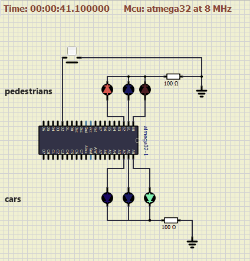
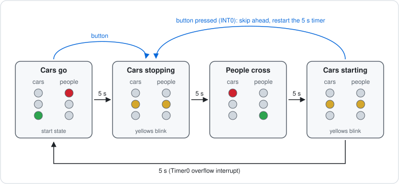

# AVR traffic light

Traffic light with a pedestrian button on an ATmega32, in C without Arduino. Project for Udacity's EgFWD Embedded Systems track (2022).

The firmware in `Build/firmware.hex` running in SimulIDE on a simulated ATmega32 at 8 MHz. Cars start on green. The pedestrian button on PD2 is pressed two seconds in, so the lights go to blinking yellow straight away instead of waiting out the 5 seconds, then pedestrians get green. The circuit file is `sim/Traffic_Light_Sim.simu`.

Cars and pedestrians each have a red, yellow and green LED. Timer0 overflows step the lights through their cycle. Pressing the button raises external interrupt 0, which switches to pedestrian mode according to the current state, and the button is disabled until the next light change so repeated presses are ignored. Yellow phases blink.

The drivers are layered:

- `MCAL/`: DIO, Timer0, external interrupts (EXTI) and the global interrupt enable
- `ECUAL/LED`: LED driver on top of DIO
- `APP/`: traffic-light states and the application

`Build/` holds a prebuilt `.hex`.
